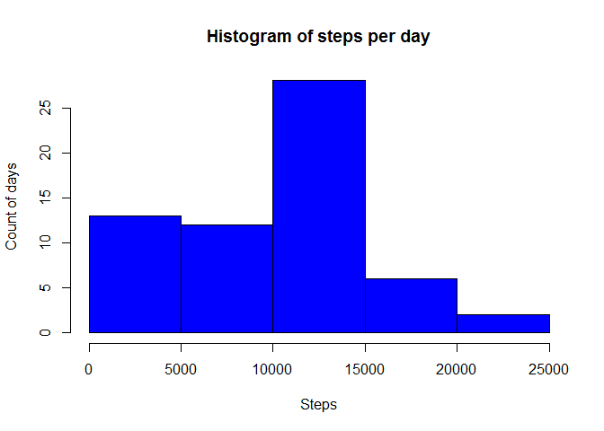
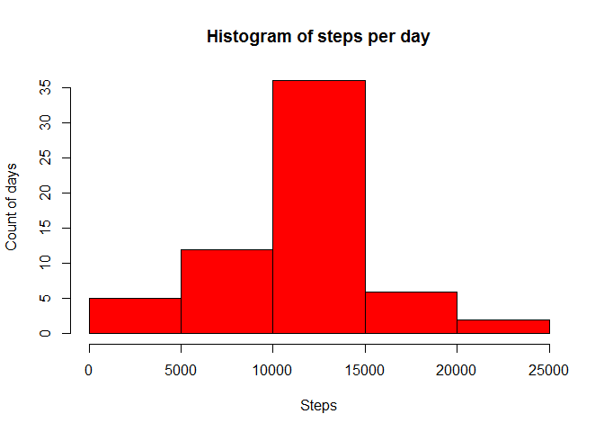

# Reproducible Research: Peer Assessment 1


## Loading and preprocessing the data
1. Loading dataset into R:

```r
file <- unzip("activity.zip", overwrite = TRUE)
activity <- read.csv(file, header = TRUE, sep = ",")
```
2. Transformation of 'date' field to Date format:

```r
activity <- transform(activity, date = as.Date(date))
```


## What is mean total number of steps taken per day?
1. Histogram of the total number of steps taken each day:  

```r
stepsPerDay <- aggregate.data.frame(x = activity$steps, by = list(activity$date), FUN = sum, na.rm = TRUE)
names(stepsPerDay) <- c("date","steps")
hist(stepsPerDay$steps, main = "Histogram of steps per day", xlab = "Steps", ylab = "Count of days", col = "blue")
```

 

2. Calculation of mean and median total number of steps taken per day:

```r
stepMean <- mean(stepsPerDay$steps, na.rm = TRUE)
stepMedian <- median(stepsPerDay$steps, na.rm = TRUE)
```
Mean = 9354.2295082. Median = 10395.


## What is the average daily activity pattern?

1. A time series plot of the 5-minute interval and the average number of steps taken, averaged across all days:

```r
stepsPerInterval <- aggregate.data.frame(x = activity$steps, by = list(activity$interval), FUN = mean, na.rm = TRUE)
names(stepsPerInterval) <- c("interval", "steps")
library(ggplot2)
g <- ggplot(stepsPerInterval, aes(x = interval, y = steps ))
g + geom_line()
```

 

2. Which 5-minute interval, on average across all the days in the dataset,
contains the maximum number of steps? - 835 inverval.


## Imputing missing values

1. Calculate and report the total number of missing values in the dataset:

```r
sum(is.na(activity))
```

```
## [1] 2304
```

2. We will replace all NAs with  the mean for respective 5-minute interval.

3. Create a new dataset that is equal to the original dataset but with the
missing data filled in:


```r
activity1 <- activity # Creating new dataset.
for (i in unique(activity1$interval)) { # For each interval ...
    z <- stepsPerInterval$steps[stepsPerInterval$interval == i] #... we select a mean number of steps.
    activity1$steps[as.logical(is.na(activity1$steps) * (activity1$interval == i))] <- z # Each NA step for current interval is replaced by mean value  
}
```

4. Make a histogram of the total number of steps taken each day:

```r
stepsPerDay1 <- aggregate.data.frame(x = activity1$steps, by = list(activity1$date), FUN = sum)
names(stepsPerDay1) <- c("date","steps")
hist(stepsPerDay1$steps, main = "Histogram of steps per day", xlab = "Steps", ylab = "Count of days", col = "red")
```

 

Calculation of mean and median total number of steps taken per day:

```r
stepMean1 <- mean(stepsPerDay1$steps)
stepMedian1 <- median(stepsPerDay1$steps)
```

New mean = 1.0766189\times 10^{4}. Old mean = 9354.2295082.  
New median = 1.0766189\times 10^{4}. Old median = 10395.

###Do these values differ from the estimates from the first part of the assignment?
As you see, mean and median are equal now and both are greater than before.

###What is the impact of imputing missing data on the estimates of the total daily number of steps?

The total daily number of steps increased from:

```r
mean(tapply(X = activity$steps, INDEX = activity$date, FUN = sum, na.rm = TRUE))
```

```
## [1] 9354.23
```
to:

```r
mean(tapply(X = activity1$steps, INDEX = activity1$date, FUN = sum, na.rm = TRUE))
```

```
## [1] 10766.19
```


## Are there differences in activity patterns between weekdays and weekends?

1. Creating a new factor variable ('day') in the dataset with two levels - "weekday" and "weekend" indicating whether a given date is a weekday or weekend day:

```r
activity1 <- transform(activity1, day = factor(ifelse(weekdays(activity1$date) %in% c("Saturday", "Sunday"), "weekend", "weekday")))
```

2. Panel plot containing a time series plot of the 5-minute interval and the average number of steps taken, averaged
across all weekday days or weekend days:


```r
library(ggplot2)
# creating new dataset with average steps per interval and weekday
stepsPerIW <- aggregate.data.frame(activity1$steps, by = activity1[,3:4], FUN = mean)
g <- ggplot(stepsPerIW, aes(x = interval, y = x))
g + geom_line() + facet_grid(facets = day ~ .) + labs(y = "steps")
```

 


